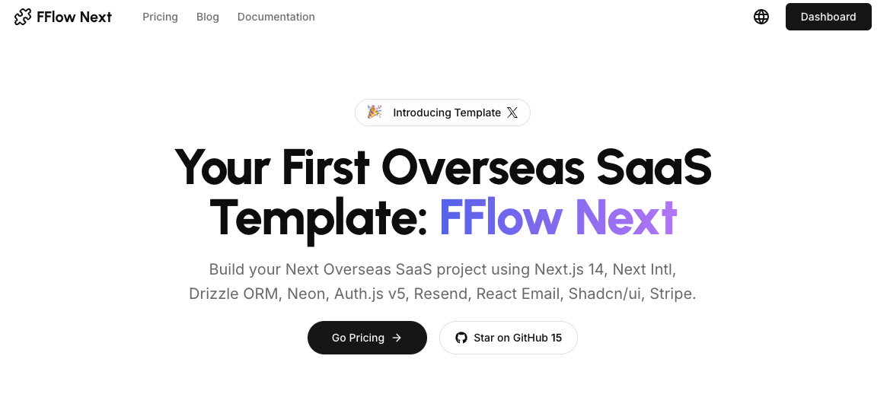

<a href="https://www.fflowlink.com">
  
</a>

<p align="center">
  <a href="https://twitter.com/hunterzhang86">
    
  </a>
</p>

<p align="center">
  <a href="./README.md"></a>
  <a href="./README_CN.md"></a>
</p>

<p align="center">
  <a href="#introduction"><strong>Introduction</strong></a> ·
  <a href="#installation"><strong>Installation</strong></a> ·
  <a href="#author"><strong>Author</strong></a> ·
  <a href="#credits"><strong>Credits</strong></a>
</p>
<br/>

## Introduction

[Click here to watch the demo video](https://app.guidde.com/share/playbooks/dCsekcnKVF3ySsS7DRHDam)

Empower your next project with the stack of Next.js 14, Drizzle, Neon, Auth.js v5, Resend, React Email, Next-Intl, Shadcn/ui, and Stripe.

All seamlessly integrated with the FFlow Next to accelerate your development and SaaS journey.

### Multi-language Support

FFlow Next supports multiple languages out of the box, making it easy to reach a global audience. Currently, we provide translations for English and Chinese, with more languages to come.

## Installation

Clone & create this repo locally with the following command:

```bash
npx create-next-app my-saas-project --example "https://github.com/hunterzhang86/fflow-next"
```

Or, deploy with Vercel:

[](https://vercel.com/new/clone?repository-url=https%3A%2F%2Fgithub.com%2Fhunterzhang86%2Ffflow-next)

### Steps

1. Install dependencies using pnpm:

```sh
pnpm install
```

2. Copy `.env.example` to `.env.local` and update the variables.

```sh
cp .env.example .env.local
```

3. Start the development server:

```sh
pnpm run dev
```

## Roadmap
- [ ] Upgrade eslint to v9
- [ ] Add resend for success subscriptions
- [ ] Add google analytics

### Frameworks

- [Next.js](https://nextjs.org/) – React framework for building performant apps with the best developer experience
- [Auth.js](https://authjs.dev/) – Handle user authentication with ease with providers like Google, Twitter, GitHub, etc.
- [Drizzle](https://orm.drizzle.team/) – Typescript-first ORM for Node.js
- [React Email](https://react.email/) – Versatile email framework for efficient and flexible email development

### Platforms

- [Vercel](https://vercel.com/) – Easily preview & deploy changes with git
- [Resend](https://resend.com/) – A powerful email framework for streamlined email development
- [Neon](https://neon.tech/) – Serverless Postgres with autoscaling, branching, bottomless storage and generous free tier.

### UI

- [Tailwind CSS](https://tailwindcss.com/) – Utility-first CSS framework for rapid UI development
- [Shadcn/ui](https://ui.shadcn.com/) – Re-usable components built using Radix UI and Tailwind CSS
- [Framer Motion](https://framer.com/motion) – Motion library for React to animate components with ease
- [Lucide](https://lucide.dev/) – Beautifully simple, pixel-perfect icons
- [`next/font`](https://nextjs.org/docs/basic-features/font-optimization) – Optimize custom fonts and remove external network requests for improved performance
- [`ImageResponse`](https://nextjs.org/docs/app/api-reference/functions/image-response) – Generate dynamic Open Graph images at the edge

### Hooks and Utilities

- `useIntersectionObserver` – React hook to observe when an element enters or leaves the viewport
- `useLocalStorage` – Persist data in the browser's local storage
- `nFormatter` – Format numbers with suffixes like `1.2k` or `1.2M`
- `capitalize` – Capitalize the first letter of a string
- `truncate` – Truncate a string to a specified length
- [`use-debounce`](https://www.npmjs.com/package/use-debounce) – Debounce a function call / state update

### Code Quality

- [TypeScript](https://www.typescriptlang.org/) – Static type checker for end-to-end typesafety
- [Prettier](https://prettier.io/) – Opinionated code formatter for consistent code style
- [ESLint](https://eslint.org/) – Pluggable linter for Next.js and TypeScript

### Miscellaneous

- [Vercel Analytics](https://vercel.com/analytics) – Track unique visitors, pageviews, and more in a privacy-friendly way

## Author

Created by [@hunterzhang86](https://twitter.com/hunterzhang86) in 2024, released under the [MIT license](https://github.com/shadcn/taxonomy/blob/main/LICENSE.md).

## Credits

This project was inspired by [next-saas-stripe-starter](https://github.com/mickasmt/next-saas-stripe-starter), shadcn's [Taxonomy](https://github.com/shadcn-ui/taxonomy), Steven Tey’s [Precedent](https://github.com/steven-tey/precedent), and Antonio Erdeljac's [Next 13 AI SaaS](https://github.com/AntonioErdeljac/next13-ai-saas).

- Shadcn ([@shadcn](https://twitter.com/shadcn))
- Steven Tey ([@steventey](https://twitter.com/steventey))
- Antonio Erdeljac ([@YTCodeAntonio](https://twitter.com/AntonioErdeljac))
- 
