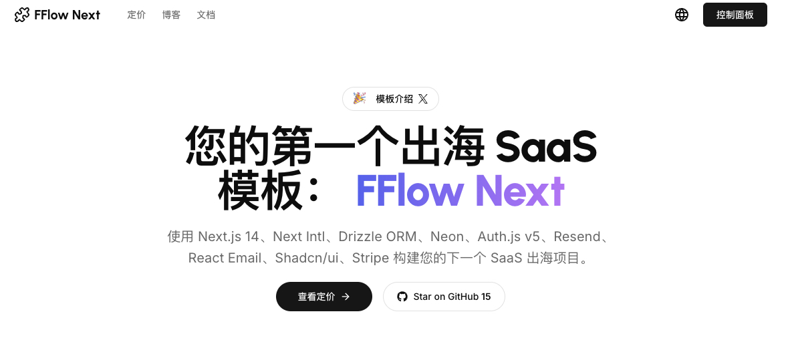

<a href="https://www.fflowlink.com">
  
</a>

<p align="center">
  <a href="https://twitter.com/hunterzhang86">
    
  </a>
</p>

<p align="center">
  <a href="./README.md"></a>
  <a href="./README_CN.md"></a>
</p>

<p align="center">
  <a href="#introduction"><strong>介绍</strong></a> ·
  <a href="#installation"><strong>安装</strong></a> ·
  <a href="#author"><strong>作者</strong></a> ·
  <a href="#credits"><strong>致谢</strong></a>
</p>
<br/>

## 介绍

使用 Next.js 14、Drizzle、Neon、Auth.js v5、Resend、React Email、Next-Intl、Shadcn/ui 和 Stripe 的技术栈，为您的 SaaS 项目赋能。

所有这些都无缝集成在 FFlow Next 中，加速您的开发和 SaaS 之旅。

### 多语言支持

FFlow Next 开箱即支持多种语言，使您轻松触达全球受众。目前我们提供英文和中文的翻译，未来将支持更多语言。

## 安装

使用以下命令克隆并创建此仓库：

```bash
npx create-next-app my-saas-project --example "https://github.com/hunterzhang86/fflow-next"
```

或者，使用 Vercel 部署：

[](https://vercel.com/new/clone?repository-url=https%3A%2F%2Fgithub.com%2Fhunterzhang86%2Ffflow-next)

### 步骤

1. 使用 pnpm 安装依赖：

```sh
pnpm install
```

2. 将 `.env.example` 复制为 `.env.local` 并更新变量。

```sh
cp .env.example .env.local
```

3. 启动开发服务器：

```sh
pnpm run dev
```

## 路线图
- [ ] 升级 eslint 到 v9
- [ ] 添加 resend 以支持成功订阅
- [ ] 添加 google analytics

### 框架

- [Next.js](https://nextjs.org/) – 构建高性能应用的 React 框架，提供最佳开发体验
- [Auth.js](https://authjs.dev/) – 轻松处理用户认证，支持 Google、Twitter、GitHub 等提供商
- [Drizzle](https://orm.drizzle.team/) – 面向 TypeScript 的 Node.js ORM
- [React Email](https://react.email/) – 高效灵活的电子邮件开发框架

### 平台

- [Vercel](https://vercel.com/) – 轻松预览和部署代码变更
- [Resend](https://resend.com/) – 强大的电子邮件开发框架
- [Neon](https://neon.tech/) – 具备自动扩展、分支、无限存储和慷慨免费层的无服务器 Postgres

### UI

- [Tailwind CSS](https://tailwindcss.com/) – 以实用为主的 CSS 框架，快速进行 UI 开发
- [Shadcn/ui](https://ui.shadcn.com/) – 使用 Radix UI 和 Tailwind CSS 构建的可重用组件
- [Framer Motion](https://framer.com/motion) – 轻松为 React 组件添加动画的库
- [Lucide](https://lucide.dev/) – 美观简洁的像素完美图标
- [`next/font`](https://nextjs.org/docs/basic-features/font-optimization) – 优化自定义字体，移除外部网络请求以提升性能
- [`ImageResponse`](https://nextjs.org/docs/app/api-reference/functions/image-response) – 在边缘生成动态 Open Graph 图像

### 钩子和实用工具

- `useIntersectionObserver` – 观察元素何时进入或离开视口的 React 钩子
- `useLocalStorage` – 在浏览器的本地存储中持久化数据
- `nFormatter` – 使用后缀格式化数字，如 `1.2k` 或 `1.2M`
- `capitalize` – 将字符串的首字母大写
- `truncate` – 将字符串截断到指定长度
- [`use-debounce`](https://www.npmjs.com/package/use-debounce) – 防抖函数调用/状态更新

### 代码质量

- [TypeScript](https://www.typescriptlang.org/) – 静态类型检查器，确保端到端的类型安全
- [Prettier](https://prettier.io/) – 统一代码风格的意见化代码格式化工具
- [ESLint](https://eslint.org/) – 可插拔的 Next.js 和 TypeScript 代码检查工具

### 其他

- [Vercel Analytics](https://vercel.com/analytics) – 以隐私友好的方式跟踪独立访客、页面浏览量等

## 作者

由 [@hunterzhang86](https://twitter.com/hunterzhang86) 创建于 2024 年，基于 [MIT 许可证](https://github.com/shadcn/taxonomy/blob/main/LICENSE.md) 发布。

## 致谢

此项目灵感来源于 [next-saas-stripe-starter](https://github.com/mickasmt/next-saas-stripe-starter)、shadcn 的 [Taxonomy](https://github.com/shadcn-ui/taxonomy)、Steven Tey 的 [Precedent](https://github.com/steven-tey/precedent) 和 Antonio Erdeljac 的 [Next 13 AI SaaS](https://github.com/AntonioErdeljac/next13-ai-saas)。

- Shadcn ([@shadcn](https://twitter.com/shadcn))
- Steven Tey ([@steventey](https://twitter.com/steventey))
- Antonio Erdeljac ([@YTCodeAntonio](https://twitter.com/AntonioErdeljac))